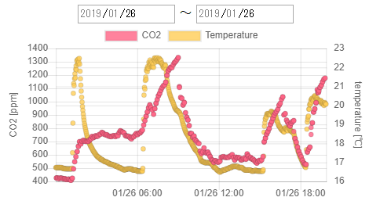

# co2-logger

[CO2-mini](https://www.amazon.co.jp/dp/B00I3XJ9LM/)による温度・二酸化炭素濃度をUSB経由で取得し記録します。
[kurain/co2mini](https://github.com/kurain/co2mini)を参考にさせていただきました。



## Installation
CO2-miniを接続してから実行してください。
```sh
git clone https://github.com/unaju/co2logger.git
cd co2logger
docker-compose up -d
```

## Usage
Installation後、バックグラウンドでデータを取得し続けます。

グラフを表示する場合は http://localhost:26733/ にアクセスしてください。

## Licence
[MIT](https://github.com/tcnksm/tool/blob/master/LICENCE)
